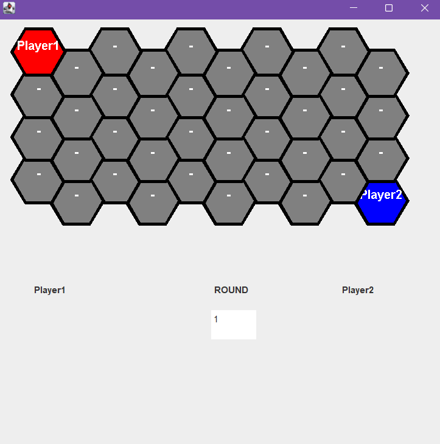
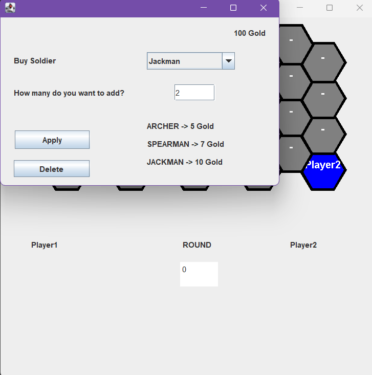
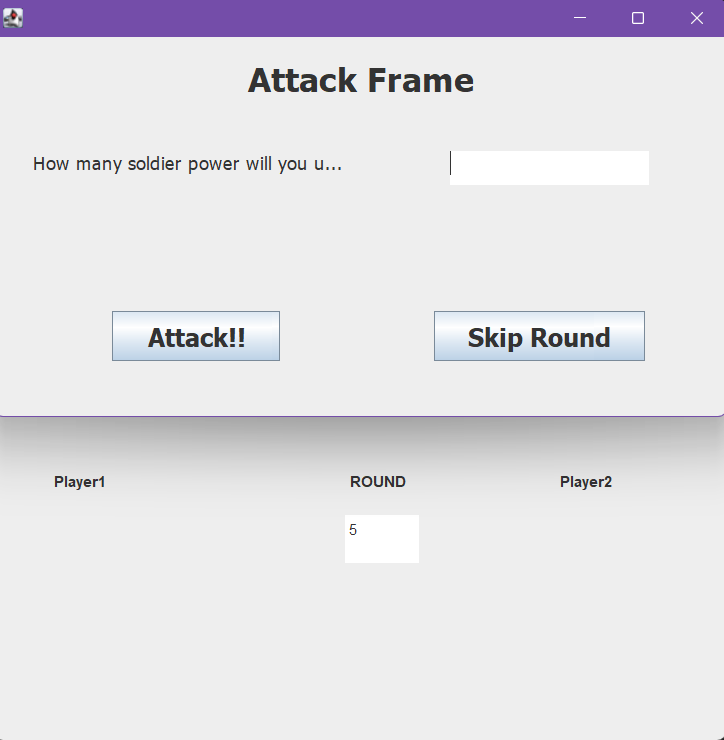
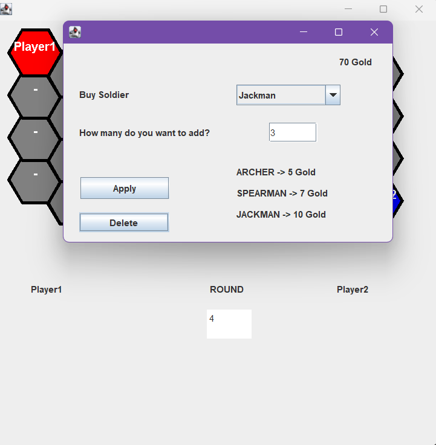
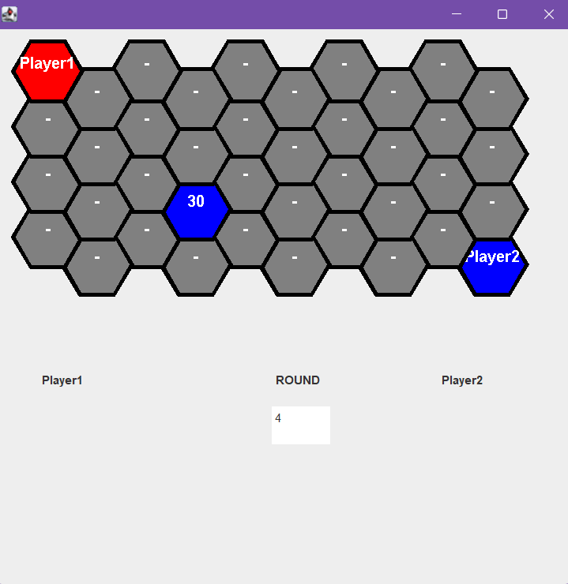

# The Conquest
Bilgehan Demirkaya 22002357
Can Kayıkcı 22103969
Emirhan Yel 22103408
Batuhan Türk 22102974

The Conquest
The Conquest is a game which 2 player is playing at the same time. It is a strategy game in which you try to defeat other player with conquering theirs areas.

How to play?
 
1. Enter your name.
2. Choose color.
3.Choose music theme or turn off music.
4. Hit the start button.

 
 
4. Choose any area which you want to capture. Then click it twice. A window will be opened. At that window:
- at top right you can see your amount of gold.
- at bottom right you can see type of soldiers and their costs.
- you can choose your type of soldier and amount of it. 
- when you hit the apply button you will not see how many soldier you have. However you will see the total power in that area. Don't forget, Jackman has 5 power, Archer has 2 power, Spearman has 3 power. So spend your gold wisely.
- if you do not have enough money to buy soldiers, you will see a warning.
 
5. The area which you choose will change to your color and your total soldier power will be written on it.
 
6. If you want to capture your opponents area First you need to choose an area which you have. Click your area then click the area which you want to capture. A window will be opened. At that window you need to use your soldier power. Enter the number of power which you want to use. Hit the Attack button.
 
7. If your power will be higher than your opponent you will capture the area. If you have the equal amount of power there will be no change about the areas.
8. If you want to withdraw your soldiers in an area double click the area, then enter the number and click the delete button. Your golds will be given to you and the area will be empty again.
 
 
9. At the beginning of the game you will have 100 gold. In every round 20 gold will be given to you.  
10. After 10 rounds the player who has more areas will win the game. 
11. Most importantly, enjoy our game. :)

